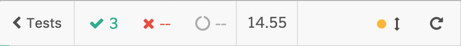

# App Actions

We have just written our first [Custom Command](signup-custom-command.md) that registers a new user for every test. What is its biggest problem? Well, it's **really, really, slow**. The <i>signup-command-1.e2e.spec.js</i> tests take twelve to fifteen seconds to run the empty tests:

<div>
    
</div>
<br /><br />

The custom command has all the faults because the tests themselves do nothing, take a look at the test code to double-check it

<i>File: cypress/integration/examples/signup-command/signup-command-1.e2e.spec.js</i>
[include](../cypress/integration/examples/signup-command/signup-command-1.e2e.spec.js)

How the duration could be improved? Let's introduce the concept of App Actions. The same way we leveraged and talked about [App Constants](app-constants.md), App Actions are utilities exposed directly from the front-end application. Let's work on a signup App Action.

In the [RealWorld app](the-realworld-project.md) front-end app, the registration is managed by the <i>Register.js</i> component. In its constructor, you can find the following code

```javascript
this.submitForm = (username, email, password) => ev => {
  ev.preventDefault();
  this.props.onSubmit(username, email, password);
};
```

`this.submitForm` is the handler that we should trigger automatically from our custom command. We could do that exposing it globally

```diff
this.submitForm = (username, email, password) => ev => {
  ev.preventDefault();
  this.props.onSubmit(username, email, password);
}
+window.appActions = window.appActions || {};
+window.appActions.signup = ({username, email, password}) => this.props.onSubmit(username, email, password);
```

but since polluting the global scope is not ideal and since we need it only when the application is under test, we could check the existence of the `window.Cypress` object before exposing it

```diff
this.submitForm = (username, email, password) => ev => {
  ev.preventDefault();
  this.props.onSubmit(username, email, password);
}

+if(window.Cypress) {
  window.appActions = window.appActions || {};
  window.appActions.signup = ({username, email, password}) => this.props.onSubmit(username, email, password);
+}
```

If you think that adding fictitious code to the application is not a good idea, remember that:

- a lot of times the source code is soiled with temporary code/conditions that allow you to manually test some particular conditions (network errors or the authenticated user)

- you can easily remove the code leveraging Webpack replacing every `window.Cypress` occurrence with `false` and then removing the unused code the same way

- test duration is more important because you are going to run the tests thousands of times

What's the final goal of the `window.appActions.signup` app action? Simply, calling it from the Cypress test! We can now call it directly deleting the slow form filling. Starting from the code of the <i>signup-v1.js</i> test, the changes are the following

```diff
-cy.findByPlaceholderText(strings.username).type(user.username);
-cy.findByPlaceholderText(strings.email).type(user.email);
-cy.findByPlaceholderText(strings.password).type(user.password);
-cy.get("form")
- .within(() => cy.findByText(strings.signUp))
- .click();
+cy.window()
+ .its("appActions")
+ .invoke("signup", user);
```

You can find the whole code of the custom command into the `signup-v2.js` custom command

<i>File: cypress/support/signup/signup-v2.js</i>
[include](../cypress/support/signup/signup-v2.js)

The `signupV2` custom command is used by the <i>signup-command-2.e2e.spec.js</i> test and the performance improvement is notable compared to the previous <i>signup-command-1.e2e.spec.js</i> one

<div>
    
</div>
<br /><br />

As you can see, there are no interactions with the form itself

<iframe width="100%" height="315" src="https://www.youtube.com/embed/usF9RiGguZE?rel=0" frameborder="0" allow="accelerometer; autoplay; encrypted-media; gyroscope; picture-in-picture" allowfullscreen></iframe>

that's how App Actions work, they're just test-related shortcuts to perform fast and safe operations.

Fast because:

- **reaching the desired front-end state through the UI is a big and slow anti-pattern**. If you take a look at the <i>signup-command-1.e2e.spec.js</i> test, form filling (performed by the <i>signup-v1.js</i> custom command) takes circa 1.5 seconds each time. We can not waste so much time for every test, what could happen when the test suite will count tens or hundreds of tests?

Safe because:

- we can unleash our imagination when we speak about testing performance improvements. We could apply every kind of esoteric solution but the truth is that a lot of them make the test harder to comprehend, to modify and less aligned with the front-end logic. App actions are clear and concise

- there are no differences between the front-end code and test code, so **there are not two different codes to be maintained**

App Actions sometimes can not be used but the more we leverage them, the more robust and fast the tests are.

### PageObject

Just for your information: [PageObject](https://martinfowler.com/bliki/PageObject.html) is the common pattern used widely before the concept of App Actions borned. The problem with the PageObject pattern is that you create one more abstraction to manage that could lose its effectiveness in a while causing more problems than advantages. If you want to deepen the comparison between the two approaches you could read the [Stop using Page Objects and Start using App Actions](https://www.cypress.io/blog/2019/01/03/stop-using-page-objects-and-start-using-app-actions/) post.

<!--

variables? to keep the user data stored?
 -->

<p style='text-align: right;'>Author: <a href="about-us.md#stefano-magni">Stefano Magni</a></p>
