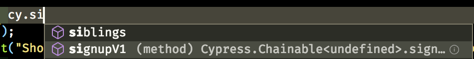
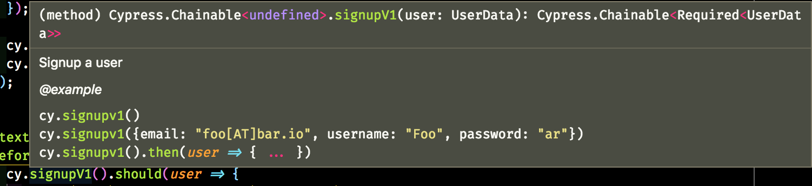

# Intellisense

The developers (included the future you) that are going to use the custom command could be helped with some autosuggestions. How could we leverage VS Code Intellisense to document our custom command?

We need to use a TypeScript definition file to add them, you just need to:

- create an `index.d.ts` file into the `cypress/support/signup` directory (where the `signup-v1.js` file is)

- add the typing itself. We are not going to speak about TypeScript itself, just take a look at the result in terms of the file itself

<i>File: cypress/support/signup/index.d.ts</i>
[include,lang:"typescript"](../cypress//support/signup/index.d.ts)

and the hints that it gives you while coding your test:

<div>
    
</div>
<div>
    
</div>
<div>
    
</div>
<br /><br />
[TypeScript](https://www.typescriptlang.org) can do more than documenting your function utilities, but for the sake of our goal just remember that:

- almost every Cypress command must be defined into the `namespace Cypress` block

```typescript
declare namespace Cypress {
  interface Chainable<Subject> {
    // ...
  }
}
```

- the question marks before the type definition make the variable optional (you are not forced to pass the user data to the custom command)

```typescript
signupV1(user?: {
  email?: string;
  username?: string;
  password?: string;
})
```

- the commands chained after the `cy.signupV1` command are going to receive the registered user details, that's why the return type of the function is

```typescript
Chainable<{
  email: string;
  username: string;
  password: string;
}>
```

<p style='text-align: right;'>Author: <a href="about-us.md#stefano-magni">Stefano Magni</a></p>
