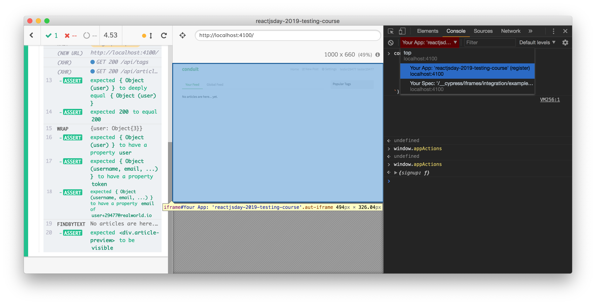
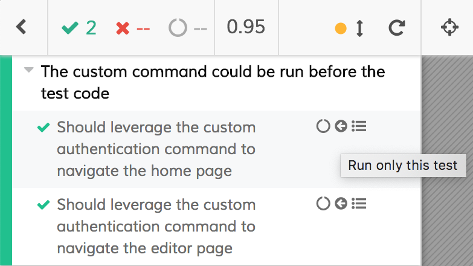

# Cypress as a development tool

Until now, we have tested an existing front-end application but usually, we are used to **writing the tests after the implementation**.

While we code the flow, we want to avoid fighting with a testing tool that goes red every now and then. That's why we manually test what we do but, most of the times, we spend a considerable amount of time showing components with temporary props, hard-coding temporary snippet that sends us directly to the desired state of the app, etc. Last but not least, **we interact** with the half-built flow **manually**. When we finish, we remove all the temporary code and we start writing all the tests.

This process has a lot of limitations:

- manually interacting with the app is slow, really slow

- adding temporary code to the codebase is potentially dangerous

- the tests that we are going to write... Do the same things we have done manually! (interacting with the app)

Instead, think for a while about our recent experience with Cypress:

- Cypress is blazing fast while interacting with the page

- the UI tests do not require special temporary code

- Cypress allows us to act as the back-end, simulating real **network conditions from a browser perspective**

What is blocking us from using Cypress during the development phase and not only during the test phase? After all, Cypress

- ✅ is always opened

- ✅ relaunch the tests as soon as we save the test file

- ✅ relaunch the test every time the application refreshes because of the Webpack DevServer (and if you have a different transpiling process you could leverage the [cypress-watch-and-reload](https://github.com/bahmutov/cypress-watch-and-reload) plugin)

- ✅ allows you to use the Chrome DevTools (the Electron ones)

even if...

- ⚠️ the real Chrome DevTools are more powerful than the Electron ones

- ❌ we can not install the React/Redux DevTools into Electron

- ⚠️ going back and forth from the test code to skip/select a test to run could be tedious

### The solution

Do you know that Cypress could be launched in **every Chrome** version? Do you know that Cypress creates a dedicated (**and persisted**) Chrome user?

Take a look at the upper right corner of the Cypress list of tests

<div>
    
</div>
<br /><br />

Cypress allows us to choose the Chrome instances that it finds on our machine. I prefer to use Chrome Canary instead of the standard Chrome just to have a different (yellow) icon and recognize immediately the testing-dedicated browser.

<div>
    
</div>
<br /><br />

and, with a real Google Chrome instance, we can install the React and Redux DevTools as usual (from the Chrome extension website).

<div>
    
</div>
<br /><br />

More: the Crome user of Cypress is persisted through all the projects! So, once we installed our extensions of choice, we can use them in every project!

The only thing we have to do to get the React DevTools working is adding the following snippet to the `public/index.html` of your create-react-app project

```html
<script>
  if (window.Cypress) {
    window["__REACT_DEVTOOLS_GLOBAL_HOOK__"] =
      window.parent["__REACT_DEVTOOLS_GLOBAL_HOOK__"];
  }
</script>
```

the snippet is needed because the React app runs inside an iframe when launched under Cypress.

About the Chrome DevTools console: to access the global scope of your app you need to change the JavaScript context in the upper-left corner of the console itself. See the next screenshot where `window.appActions` (defined during the [App Actions chapter](app-actions.md)) becomes available only after a context selection.



To avoid going back and forth from the code test to exclude/select the tests: we could add the [cypress-skip-and-only-ui](https://github.com/bahmutov/cypress-skip-and-only-ui) plugin that adds some buttons to the Test Runner. These buttons allow us to run only a test, to skip some tests or to restore the standard order of the tests. It does, through some simple buttons, what we usually do manually adding `.only` or `.skip` to the tests.

<div>
    
</div>
<br /><br />

With all the above tips you discover a new way of working... And you discover that `cy.findByPlaceholderText("Username").type("Foo")` is way faster than your manually typing. And when you finish... You have already written the tests!

Please note: **this is not TDD**! We have just talked about how to leverage a testing tool to improve our productivity but the aim is not to start TDDing. You should forget about TDD until you are a practiced testing-developer and you work in a team/company that creates the right environment for an approach like that.

<p style='text-align: right;'>Author: <a href="about-us.md#stefano-magni">Stefano Magni</a></p>
