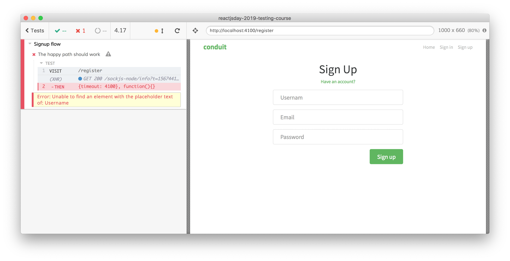

# cypress-testing-library

Have you probably heard about the amazing [Testing Library](https://testing-library.com) of [Kent C. Dodds](https://kentcdodds.com) (and if you have not, do not worry, you are in the right place). Without anticipating too much, Testing Library is based on the assumption that **the tests must consume the web app the same way the consumer does**.

What does it mean? Well, try thinking about how your users consume a web app: they look for contents, labels, placeholders, buttons, etc. to interact with them. They do not care about selectors, **they care about contents**.

Take a look at the test we wrote

<i>File: <a href="../cypress/integration/examples/signup/signup-3.e2e.spec.js" target="_blank">cypress/integration/examples/signup/signup-3.e2e.spec.js</a></i>
[include](../cypress/integration/examples/signup/signup-3.e2e.spec.js)

After all, an input field with that responds to the `[data-testid=username]` selector do not give us the confidence that the user can consume it, nor that the right element has the `data-testid` attribute.

The Testing Library has a lot of plugins, one of them is [dedicated to Cypress](https://github.com/testing-library/cypress-testing-library).

Adding a plugin to Cypress is straightforward, in case of cypress-testing-library, you must:

- install it with `$ npm install --save-dev @testing-library/cypress`

- add `import '@testing-library/cypress/add-commands'` to the `cypress/support/commands.js` file

Now we can leverage all the Testing Library functions, like `getByText`, `getByPlaceholderText`, etc. Thank it, we can make out test more robust, more readable, and more debuggable.

We need to change all the `cy.get` calls to the corresponding functions (added on the `cy` global object by Testing Library)

```javascript
it("The happy path should work", () => {
  cy.visit("/register");
  const random = Math.floor(Math.random() * 100000);
  cy.getByPlaceholderText("Username").type(`Tester${random}`);
  cy.getByPlaceholderText("Email").type(`user+${random}@realworld.io`);
  cy.getByPlaceholderText("Password").type("mysupersecretpassword");
  cy.getByText("Sign up").click();
  cy.getByText("No articles are here... yet.", { timeout: 10000 }).should("be.visible");
});
```

Take a look at the test code, every command now is 100% aligned to what the user does while he/she tries to signup!

### Less debugging required

There is another, not to be ignored, advantage: what happens with the previous, `data-testid`-based, test when it fails?

We know what is the Test Runner feedback

<div>
    
</div>
<br /><br />
but this kind of feedback/error is generated by three different causes:

- the input field does not exist

- the input field exists but it has not the `data-testid` attribute,

- the input field exists but its `data-testid` attribute is not set to `username`

Both the latter cases have not a visual correspondence (if you look at the web app, the input field exists!) and require you, in order to fix the issue, to open Cypress, run the test, inspect the DOM element, and check for its `data-testid` attribute. That's not an hour-long process but, again, if only the test could give us more useful feedback...

`cy.getByPlaceholderText` does exactly what we're speaking about! If it fails



you just need to take a look at the Cypress screenshot (that it [saves automatically](https://docs.cypress.io/guides/guides/screenshots-and-videos.html#Screenshots)) to check if

- the input field does not exist

- the input field has not the placeholder

- the input field has not the right placeholder

and we avoid a debugging process!

### Multiple elements

If we try to run the updated test

```javascript
it("The happy path should work", () => {
  cy.visit("/register");
  const random = Math.floor(Math.random() * 100000);
  cy.getByPlaceholderText("Username").type(`Tester${random}`);
  cy.getByPlaceholderText("Email").type(`user+${random}@realworld.io`);
  cy.getByPlaceholderText("Password").type("mysupersecretpassword");
  cy.getByText("Sign up").click();
  cy.getByText("No articles are here... yet.", { timeout: 10000 }).should("be.visible");
});
```

we get an error


<br /><br />
more in detail, the error is the following

<div>
    
</div>
<br /><br />

The error is pretty self-explanatory if you look at the UI, there are we different elements with the same text "_Sign Up_": the title and the button.

There are a lot of different solutions to leverage the `getByText` function distinguishing between the title and the button. The next solutions are just to get you to familiarize with the Cypress logics, the first three solutions are probably the best ones. We could:

- use the [`within`](https://docs.cypress.io/api/commands/within.html) API to restrict the searching power of `getByText`

```javascript
cy.get("form")
  .within(() => cy.getByText("Sign up"))
  .click();
```

- leverage the `selector` option of `getByText`

```javascript
cy.getByText("Sign up", { selector: "button" }).click();
```

- leverage the `container` option of `getByText`

```javascript
cy.get("form")
  .then(subject => cy.getByText("Sign up", { container: subject }))
  .click();
```

- select the second element returned by the `getAllByText` API (insead of the `getByText` one)

```javascript
cy.getAllByText("Sign up")
  .then($el => $el[1])
  .click();
```

- use `jQuery.grep` (the jQuery version of `array.find`)

```javascript
cy.getAllByText("Sign up")
  .then($els => Cypress.$.grep($els, el => el.tagName.toLowerCase() === "button"))
  .click();
```

Please note: Cypress automatically [exposes jQuery through `Cypress.$`](https://docs.cypress.io/api/utilities/$.html).

<br /><br />

There is an important difference between how `cy.contains` and `cy.getByText` work:

- `cy.contains` retrieves DOM elements even without an exact match (`cy.contains("No articles are here")` works)
- `cy.getByText` does not retrieve DOM elements without an exact match (`cy.getByText("No articles are here")` does not work, you need to replace it with `cy.getByText("No articles are here... yet.")`)

Using Testing Library, the test becomes the following

<i>File: <a href="../cypress/integration/examples/signup/signup-4.e2e.spec.js" target="_blank">cypress/integration/examples/signup/signup-4.e2e.spec.js</a></i>
[include](../cypress/integration/examples/signup/signup-4.e2e.spec.js)

<!-- TODO: not always can be used -->
<!-- TODO: i18n -->
<!-- assert about all the elemements visibility -->
