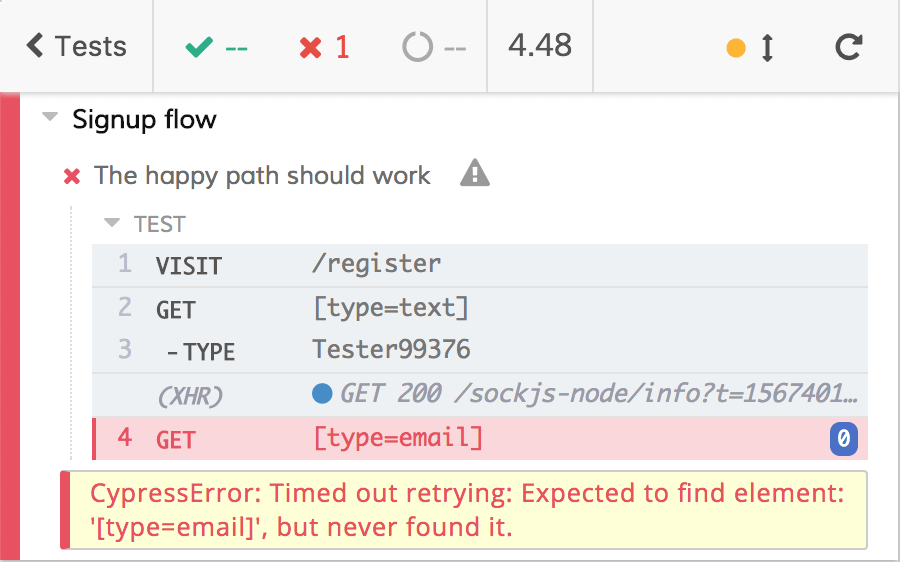
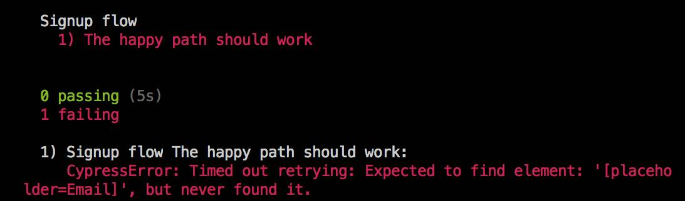
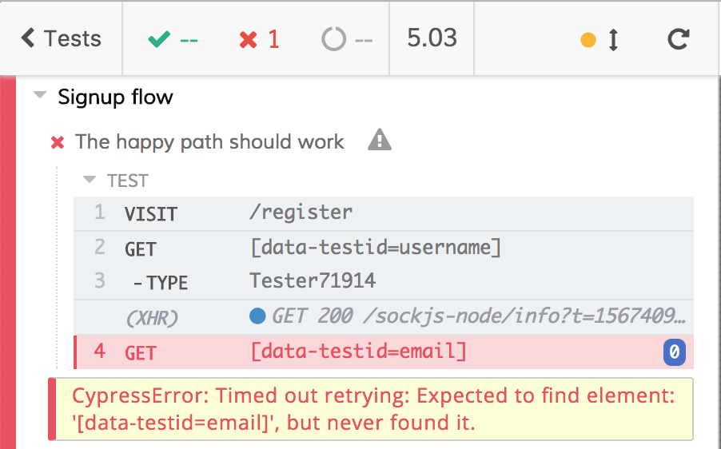

# data-testid

We managed to have a deterministic event test like the following

<i>File: cypress/integration/examples/signup/signup-2.e2e.spec.js</i>
[include](../cypress/integration/examples/signup/signup-2.e2e.spec.js)

but, as we've seen, one of the defects of the above test is its uselessness while something goes wrong by retrieving the elements to interact with.

<div>
    
</div>

<br /><br />
The HTML of the form is the following

```html
<form>
  <fieldset>
    <fieldset class="form-group">
      <input
        class="form-control form-control-lg"
        type="text"
        placeholder="Username"
        value=""
      />
    </fieldset>
    <fieldset class="form-group">
      <input
        class="form-control form-control-lg"
        type="email"
        placeholder="Email"
        value=""
      />
    </fieldset>
    <fieldset class="form-group">
      <input
        class="form-control form-control-lg"
        type="password"
        placeholder="Password"
        value=""
      />
    </fieldset>
    <button class="btn btn-lg btn-primary pull-xs-right" type="submit">
      Sign up
    </button>
  </fieldset>
</form>
```

If we want to avoid basing the test on the order, we can leverage

- the type: text, email, and password

- the placeholder

The test could become the following

```diff
context("Signup flow", () => {
  it("The happy path should work", () => {
    cy.visit("/register");
-    cy.get(".form-control").then($els => {
-      const random = Math.floor(Math.random() * 100000);
-      cy.get($els[0]).type(`Tester${random}`);
-      cy.get($els[1]).type(`user+${random}@realworld.io`);
-      cy.get($els[2]).type("mysupersecretpassword");
-    });
+   const random = Math.floor(Math.random() * 100000);
+   cy.get("[type=text]").type(`Tester${random}`);
+   cy.get("[type=email]").type(`user+${random}@realworld.io`);
+   cy.get("[type=password]").type("mysupersecretpassword");
    cy.get("button").click();
    cy.contains("No articles are here", { timeout: 10000 }).should("be.visible");
  });
});
```

or, leveraging the placeholder

```diff
context("Signup flow", () => {
  it("The happy path should work", () => {
    cy.visit("/register");
-    cy.get(".form-control").then($els => {
-      const random = Math.floor(Math.random() * 100000);
-      cy.get($els[0]).type(`Tester${random}`);
-      cy.get($els[1]).type(`user+${random}@realworld.io`);
-      cy.get($els[2]).type("mysupersecretpassword");
-    });
+   const random = Math.floor(Math.random() * 100000);
+   cy.get("[placeholder=Username]").type(`Tester${random}`);
+   cy.get("[placeholder=Email]").type(`user+${random}@realworld.io`);
+   cy.get("[placeholder=Password]").type("mysupersecretpassword");
    cy.get("button").click();
    cy.contains("No articles are here", { timeout: 10000 }).should("be.visible");
  });
});
```

Both of them work as expected when everything is ok, but if the email input field is not rendered they allow us to understand what's wrong

<div>
    
</div>
<div>
    
</div>

You get the same feedback if you run Cypress through `cypress run` (most of the times you'll find broken tests in the terminal or reading the logs)



### What not to do

Forget for a while the RealWorld form, there are a ton of selectors we can use when finding DOM elements, but most of them could change because of different purposes (and then break the test inadvertently):

| Selector        | Purpose             |
| --------------- | ------------------- |
| classes         | Style               |
| ids             | JavaScript          |
| HTML tags       | standardization/SEO |
| type            | User experience     |
| ARIA attributes | User experience     |

These selectors do not have testing purposes, the more the tests use them, the more they're fragile. You could not blame yourself or a colleague of your when, after 20 minutes of watching the pipeline and debugging the app, you discover that the test broke because of a class is changed. The problem is not in the web app, the problem is in the test.

You need to use a dedicated attribute, one that will not change because of other needs, and this is `data-testid` (or `data-test`, or `data-cy`, etc.). No one is going to change a `data-testid` attribute, even if he/she does not know what it means.

The markup of the form must be changed with the new attribute

```diff
<form>
  <fieldset>
    <fieldset class="form-group">
-     <input class="form-control form-control-lg" type="text" placeholder="Username" value="" />
+     <input class="form-control form-control-lg" type="text" placeholder="Username" value="" data-testid="username"/>
    </fieldset>
    <fieldset class="form-group">
-     <input class="form-control form-control-lg" type="email" placeholder="Email" value="" />
+     <input class="form-control form-control-lg" type="email" placeholder="Email" value="" data-testid="email"/>
    </fieldset>
    <fieldset class="form-group">
-     <input class="form-control form-control-lg" type="password" placeholder="Password" value="" />
+     <input class="form-control form-control-lg" type="password" placeholder="Password" value="" data-testid="password"/>
    </fieldset>
-   <button class="btn btn-lg btn-primary pull-xs-right" type="submit">Sign up</button>
+   <button class="btn btn-lg btn-primary pull-xs-right" type="submit" data-testid="signup-button">Sign up</button>
  </fieldset>
</form>
```

and the test must be adapted too

```diff
context("Signup flow", () => {
  it("The happy path should work", () => {
    cy.visit("/register");
    const random = Math.floor(Math.random() * 100000);
-   cy.get("[placeholder=Username]").type(`Tester${random}`);
-   cy.get("[placeholder=Email]").type(`user+${random}@realworld.io`);
-   cy.get("[placeholder=Password]").type("mysupersecretpassword");
-   cy.get("button").click();
-   cy.contains("No articles are here", { timeout: 10000 }).should("be.visible");
+   cy.get("[data-testid=username]").type(`Tester${random}`);
+   cy.get("[data-testid=email]").type(`user+${random}@realworld.io`);
+   cy.get("[data-testid=password]").type("mysupersecretpassword");
+   cy.get("[data-testid=signup-button]").click();
+   cy.get("[data-testid=no-articles-here]", { timeout: 10000 }).should("be.visible");
  });
});
```

This way the test leverages dedicated attributes and selectors, ones that do not change for non-testing purposes. The feedback in case of failure is almost the same as the previous test (good).

<div>
    
</div>
<br /><br />
The test is now resilient, well done. The following is the complete test

<i>File: cypress/integration/examples/signup/signup-3-data-testid.e2e.spec.js</i>
[include](../cypress/integration/examples/signup/signup-3-data-testid.e2e.spec.js)

Compared to the previous version, in case of failures related to the DOM elements, the test helps us to identify precisely what does not work (if it's related to the DOM elements) 👍

<p style='text-align: right;'>Author: <a href="about-us.md#stefano-magni">Stefano Magni</a></p>
