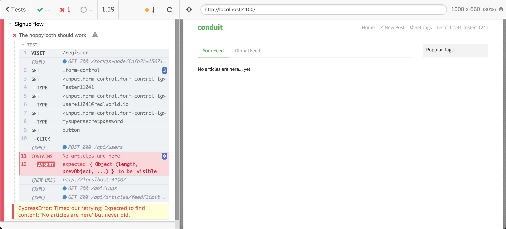

Main E2E test defects

# Stability

If you run the test multiple times you can encounter some failures like this



In detail, the Cypress Test Runner says

<div>
    
</div>

it means that the "_No articles are here_" string does not exist in the page, but why? The first screenshot shows that the signup process worked, why did the test fail?

Do you remember that [Cypress waits automatically](cypress-waitings-and-execution-order.md#automatic-waiting)? Well, it's true, but it does not wait forever, `cy.get` and `cy.contains` wait up to 4 seconds (by default) but if the AJAX call lasts more than 4 seconds we are out of luck.

The fastest (but not the robust) solution is to increase the `cy.contains` timeout with the following change

```diff
-cy.contains("No articles are here").should("be.visible");
+cy.contains("No articles are here", { timeout: 10000 }).should("be.visible");
```

Now the test is going to succeed most of the times.

The complete test is the following:

<i>File: cypress/integration/examples/signup/signup-2.e2e.spec.js</i>
[include](../cypress/integration/examples/signup/signup-2.e2e.spec.js)

Anyway: this test started smelling a while ago, go ahead to read why should we improve it.

Please note: you must completely avoid fixed-time waitings (`cy.wait(10000)` with Cypress) because you make the tests extremely slow! Read more about that [here](https://dev.to/noriste/await-do-not-make-your-e2e-tests-sleep-4g1o).

<p style='text-align: right;'>Author: <a href="about-us.md#stefano-magni">Stefano Magni</a></p>
