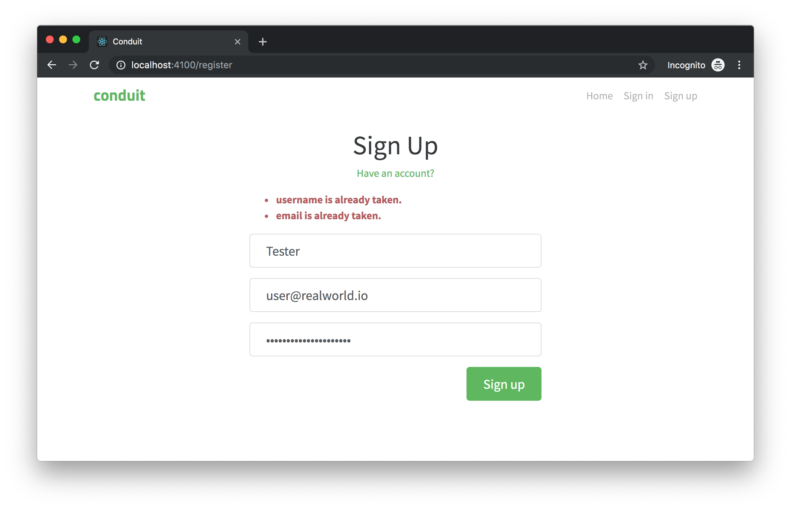

# Front-end testing on steroids

Stubbing an AJAX request is easy and advantageous with Cypress, and allows us to concentrate on testing the front-end application, **forgetting about the back-end** one. That's really important because E2E tests are often considered the only solution to the front-end testing problem, but with so much disadvantages that they discouraged a lot of developers.

Anyway, two of the three main E2E testing problems were front-end developer independence and edge case replication. We can face both of them are easy with UI Integration Testing and back-end stubs. As an example, we could test the error paths that could happen with the registration flow. At the moment, the state of the art of our integration signup flow is the following:

<i>File: cypress/integration/examplessignup-integration/signup-2.integration.spec.js</i>
[include](../cypress/integration/examples/signup-integration/signup-2.integration.spec.js)

but there are a lot of error paths that are not been covered yet. The [RealWorld](the-realworld-project.md) front-end does not manage "all" possible paths, but then if the back-end app responds with an error "email/user already registered", it prints the error as they are.




Spying the back-end response, it turns out that its something like `{ errors: { email: "is already taken." } }` and the response status is `422`. We need to reproduce it with the `cy.route`, [its options](https://docs.cypress.io/api/commands/route.html#Arguments) contemplate the `status` option too. All we need to do is passing all exploded options to the `cy.route` command

```javascript
cy.route({
  url: "**/api/users",
  method: "POST",
  status: 422,
  response: { errors: { email: "is already taken." } }
}).as("signup-request");
```

the `url`, `method`, and `response` are not new, the `status` option is. With a response like this, the error reported by the front-end is "email is already taken.". The test is not so many different from the old one (the happy path flow), that's the full code

```javascript
it("Should show an error if the back-end report that the email has already been used", () => {
  const user = {
    username: "Tester",
    email: "user@realworld.io",
    password: "mysupersecretpassword"
  };

  cy.server();
  cy.route({
    url: "**/api/users",
    method: "POST",
    status: 422,
    response: { errors: { email: "is already taken." } }
  }).as("signup-request");

  cy.visit(paths.register);

  cy.window()
    .its("appActions")
    .invoke("signup", user);

  cy.wait("@signup-request");

  cy.findByText("email is already taken.").should("be.visible");
});
```

We could make it even more generic testing the case of multiple errors coming from the back-end

```diff
-it("Should show an error if the back-end report that the email has already been used", () => {
+it("Should show some errors if the back-end reports that some data has already been used", () => {
+ const response = { errors: { username: "is already taken.", email: "is already taken." } };
  const user = {
    username: "Tester",
    email: "user@realworld.io",
    password: "mysupersecretpassword"
  };

  cy.server();
  cy.route({
    url: "**/api/users",
    method: "POST",
    status: 422,
-   response: { errors: { email: "is already taken." } }
+   response
  }).as("signup-request");

  cy.visit(paths.register);

  cy.window()
    .its("appActions")
    .invoke("signup", user);

  cy.wait("@signup-request");

- cy.findByText("email is already taken.").should("be.visible");
+ Object.entries(response.errors).map(([subject, error]) => {
+   cy.findByText(`${subject} ${error}`).should("be.visible");
+ });
});
```

Below there are both the single-error test and the multiple-errors one

<i>File: cypress/integration/examplessignup-integration/signup-error-paths-1.integration.spec.js</i>
[include](../cypress/integration/examples/signup-integration/signup-error-paths-1.integration.spec.js)

Almost all the code of the tests is the same. Keeping in mind that we must resist adding complex abstractions to the code of the tests (see the [testing rules](testing-rules.md#dry)) we could separate some code to a dedicated function and leverage it from the body of the test. After all, only the response changes between the above tests... Take a look at the following code

<i>File: cypress/integration/examplessignup-integration/signup-error-paths-2.integration.spec.js</i>
[include](../cypress/integration/examples/signup-integration/signup-error-paths-2.integration.spec.js)

The last test checks that the front-end prints the errors as they are, so we are sure that the errors showed to the user are completely driven by the back-end.

Please note that Cypress has other interesting options to simulate network behaviors, like the [`delay` option](https://docs.cypress.io/api/commands/route.html#Use-delays-for-responses) or using a [function as the response](https://docs.cypress.io/api/commands/route.html#Set-the-routing-options-using-a-callback-function), etc.

With the recent examples, it should be clear that E2E testing is good but not practical at all! So, write a few E2E tests (just for the happy paths) and concentrate on the UI Integration Tests.

<p style='text-align: right;'>Author: <a href="about-us.md#stefano-magni">Stefano Magni</a></p>
