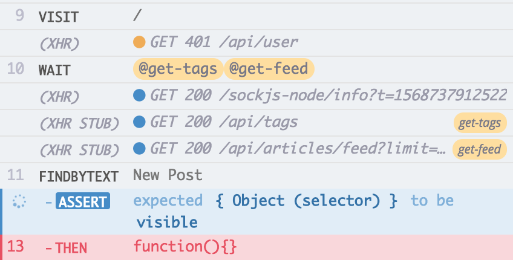

# Custom command

The same way we have created a custom [signup command](signup-custom-command.md) for the E2E tests, we could create an authentication command for the UI Integration Tests too. It will be way far simpler because we do not need a real signup/authentication, obviously: we just need that the **front-end thinks that's authenticated**.
<br />
What we have to do is essentially setting the `jwt` token into the local storage. Let's write the `authenticateIntegration` custom command.

Where we can get a valid `jwt`? Well, from the `signup.json` fixture!

<i>File: cypress/fixtures/users/signup.json</i>
[include](../cypress/fixtures/users/signup.json)

Cypress allows us to read the fixtures using the `cy.fixture` command. All we need to do is:

- reading the fixture

- reading the contained token

- setting the `jwt` token

The command code is the following

<i>File: cypress/support/authentication/authenticate-integration.js</i>
[include](../cypress/support/authentication/authenticate-integration.js)

Please note that there are some assertions about the fixture content itself, the goal is always the same: getting the more out of the assertion feedback. If we change the fixture content accidentally the command is going to prompts us with a useful message.

The test that navigates the home page leveraging an already "authenticated" is the following

```javascript
context("The custom command could be run before the test code", () => {
  it("Should leverage the custom authentication command", () => {
    cy.authenticateIntegration().should(user => {
      expect(user).to.have.property("username").and.not.to.be.empty;
      expect(user).to.have.property("email").and.not.to.be.empty;
    });

    cy.server();
    cy.route("GET", "**/api/tags", "fixture:tags/empty-tags").as("get-tags");
    cy.route(
      "GET",
      "**/api/articles/feed**",
      "fixture:articles/empty-articles"
    ).as("get-feed");

    cy.visit("/");

    cy.wait(["@get-tags", "@get-feed"]);

    cy.findByText(newPost).should("be.visible");
  });
});
```

But, when running it, we get an error from Cypress

<div>
    
</div>
<br /><br />

the Test Runner speaks for itself: the [RealWorld](the-realworld-project.md) front-end fires a `GET api/user` expecting the same data returned by the signup AJAX request (`POST api/users`), nothing that we cannot stub and wait in a while

```diff
+cy.route("GET", "**/api/user", "fixture:users/signup").as("get-user");
cy.route("GET", "**/api/tags", "fixture:tags/empty-tags").as("get-tags");
cy.route("GET", "**/api/articles/feed**", "fixture:articles/empty-articles").as("get-feed");
```

```diff
-cy.wait(["@get-tags", "@get-feed"]);
+cy.wait(["@get-user", "@get-tags", "@get-feed"]);
```

Here the full code of the test

<i>File: cypress/integration/examples/authenticate-command/authenticate-command-1.integration.spec.js</i>
[include](../cypress/integration/examples/authenticate-command/authenticate-command-1.integration.spec.js)

### An all-in-one command

Since the front-end does a call to the `GET api/user` API as its very first thing, we could write a more complete command that cares about the request itself. We only have to move part of the code of the <i>authenticate-command-1.integration.spec.js</i> test to the command code.

```diff
+import { newPost } from "../../../realworld/frontend/src/components/Header";

-Cypress.Commands.add("authenticateIntegration", () => {
+Cypress.Commands.add("authenticateAndVisitIntegration", path => {
+ cy.server();
+ cy.route("GET", "**/api/user", "fixture:users/signup").as("get-user");
  cy.fixture("users/signup")
    .its("user")
    .should(
      user =>
        expect(user)
          .to.have.property("token")
          .and.to.be.a("string").and.not.to.be.empty
    )
    .then(user => localStorage.setItem("jwt", user.token));
+ cy.visit(path);
+ cy.wait("@get-user");
+ cy.findByText(newPost).should("be.visible");
});
```

The new `authenticateAndVisitIntegration` command is way more complete and the previous "visit the home page" test could be simplified

```diff
it("Should leverage the custom authentication command", () => {
- cy.authenticateIntegration().should(user => {
-   expect(user).to.have.property("username").and.not.to.be.empty;
-   expect(user).to.have.property("email").and.not.to.be.empty;
- });

  cy.server();
- cy.route("GET", "**/api/user", "fixture:users/signup").as("get-user");
  cy.route("GET", "**/api/tags", "fixture:tags/empty-tags").as("get-tags");
  cy.route("GET", "**/api/articles/feed**", "fixture:articles/empty-articles").as("get-feed");

- cy.visit("/");
+ cy.authenticateAndVisitIntegration("/");

- cy.wait(["@get-user", "@get-tags", "@get-feed"]);
+ cy.wait(["@get-tags", "@get-feed"]);

- cy.findByText(newPost).should("be.visible");
});
```

and a generic "visit and check" test is something like this:

```javascript
it("Should leverage the custom authentication command to navigate the editor page", () => {
  cy.authenticateAndVisitIntegration("/editor");
  // the rest of the code
});
```

The complete code is the following

<i>File: cypress/integration/examples/authenticate-command/authenticate-command-2.integration.spec.js</i>
[include](../cypress/integration/examples/authenticate-command/authenticate-command-2.integration.spec.js)

Take a look at the duration of the second test

<div>
    
</div>
<br /><br />

it takes just three tenths of a second to have everything set up as an authenticated user, before starting to test its own flow. Just three tenths of a second! This is what we mean when we talk about the importance of fast tests!

<p style='text-align: right;'>Author: <a href="about-us.md#stefano-magni">Stefano Magni</a></p>
