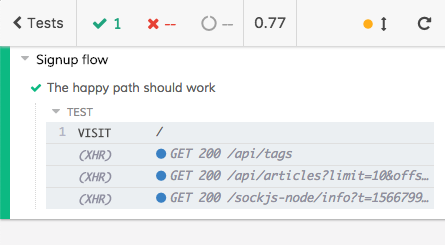

# Opening Cypress

Let's start with a real Cypress test:

<i>File: cypress/integration/examples/signup/signup-1.e2e.spec.js</i>
[include](../cypress/integration/examples/signup/signup-1.e2e.spec.js)

A closer look line by line:

- `/// <reference types="Cypress" />` allows us to leverage [VS Code Intellisense](https://code.visualstudio.com/docs/editor/intellisense) for the autocompletion
  

- `context("...` is the same of `describe("...`, it helps to group some related tests

- `it("...` is the same of `test("...`, it contains the test instructions

- about the name of the file (`signup-1.e2e.spec.js`):

  - `xxx.spec.js` (or `xxx.test.js`, it's the same) helps identifying in a while the purpose of the test
  - `xxx.e2e.xxx` helps identifying the type of the test, it allows you to run only some kind of tests with a single command (ex. `npx cypress run --spec "cypress/integration/**/*.e2e.*"`)

- `cy.visit("/");` is the first line of the test itself, it visits the home page of [Conduit](the-realworld-project.md)

How could Cypress know which is the URL of the whole site? Take a look at Cypress config file

<i>File: cypress.json</i>
[include](../cypress.json)

the `baseUrl` property tells Cypress the domain the site is available. This property can be overwritten through the [command line](https://docs.cypress.io/guides/references/configuration.html#Command-Line) and allows the Cypress tests to load faster.

### Cypress open

In order to see the test running, we must now open Cypress. Run `$ npm run cy:open` in your terminal and the list of Cypress tests comes up. Click on the `examples/signup/signup-1.e2e.spec.js`

If Cypress prompts you with an alert like the following one, it's because you have not the Conduit website running

Launch `npm run realworld:start` in the terminal and everything is going to work. In case of troubles take a look at the [Conduit](the-realworld-project.md) chapter.

Now you can see the page launched by the test

### The Test Runner

On the left you can see the Test Runner, it's one of the greatest features of Cypress. It allows you to analyze what's happening in the front-end application.

  

  
Being able to read what's happening in the front-end app is amazing because you have most of the needed feedback while developing/debugging/testing. **You know all the details** about the AJAX calls the front-end is doing, you know if some errors happened in the front-end code, you know what Cypress is doing, you know the result of the assertions...

We are going to deepen some of the Test Runner capabilities but we can find everything about it on the [official Cypress Documentation](https://docs.cypress.io/guides/core-concepts/test-runner.html#Running-Experiments).

Author: <a href="about-us.md#stefano-magni">Stefano Magni</a>

