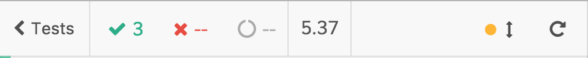

# Sharing authentication state

We know that the state must not be shared between subsequent tests because it's the reason #1 for brittle tests. But when you know the rules, you know the motivations behind them and how to bend them to your needs.

Citing again the [testing rules](testing-rules.md#shared-state): why should we not share the state between tests? Imagine this scenario:

- `test a` registers a new user and does actions that need the user to be registered

- `test b` does actions that need the user to be registered

You are going to break the `test b` test if

- you run it alone with `it.only()`

- you skip the `test a` with `it.skip()`

- you change the order

- you move the `test b` to another file or vice-versa

summing up: every test **must be independent**.

In the previous chapter, we improved the test performance but it's still quite slow. Every test registers a new user and it would be cool if all the tests could share the same, already registered, user... But if we only have to maintain test independence, we could write a custom command that registers a new user, store the user token and restore the token before the next step!

One thing at a time:

- the [RealWorld](the-realworld-project.md) front-end stores the user token with a `jwt` local storage field

<div>
    
</div>
<br /><br />

- we could copy it after the first registration (it can be accessed in Cypress with `localStorage.jwt`)

- then, we can restore it for every future test (checking that the user is still valid and authenticated for the back-end)

Let's write the `cy.signupV3` custom command, starting from the `cy.signupV2` command that's the following:

<i>File: cypress/support/signup/signup-v2.js</i>
[include](../cypress/support/signup/signup-v2.js)

### `cy.gignupV3`

###### Storing the token

```diff
/// <reference types="Cypress" />

import { paths } from "../../../realworld/frontend/src/components/App";
import { noArticles } from "../../../realworld/frontend/src/components/ArticleList";

+let previousUserData = {};
Cypress.Commands.add("signupV2", ({ email, username, password } = {}) => {
  // ... the command code...

  cy
+ // wait until the localStorage token is saved
+   .wrap(localStorage)
+   .its("jwt")
+   .should(jwt => expect(jwt).to.be.a("string").and.not.to.be.empty)
+   .then(jwt => {
+     previousUserData = {
+       jwt,
+       username,
+       email,
+       password,
+       user
+     };
+   })
    .then(() => user);
});
```

What the new code does:

- waits until the `localStorage.jwt` token is available, the front-end does not set it synchronously (or, better, you should get accustomed that nothing is synchronous with E2E tests). This waiting is made easy by the inner [Cypress retry-ability](https://docs.cypress.io/guides/core-concepts/retry-ability.html) that retries the previous command (unless it could potentially change the state of the application under test like a `click` could do) until the assertions pass.
  <br />
  So, the `jwt` retrieval (`.its("jwt")`) is retried until the next assertion `.should(jwt => expect(jwt).to.be.a("string").and.not.to.be.empty)` passes.

- once the `jwt` token is set, it stores all the user data (the token, the parameters, and the new `user` object)

- "returns" the `user` object with `.then(() => user)`. It's an asynchronous flow so it "returns" the object by chaining it

###### Initial token check

```diff
/// <reference types="Cypress" />

import { paths } from "../../../realworld/frontend/src/components/App";
import { noArticles } from "../../../realworld/frontend/src/components/ArticleList";

let previousUserData = {};
-Cypress.Commands.add("signupV2", ({ email, username, password } = {}) => {
+Cypress.Commands.add("signupV3", ({ email, username, password, ignoreLocalStorage = false } = {}) => {
+   let user;
    // if the user data match the previous one
+   if (!ignoreLocalStorage && previousUserData.jwt && previousUserData.email === email) {
+     cy.log("signupV3: Authentication check ⚠️");

      // set the stored token
+     localStorage.setItem("jwt", previousUserData.jwt);

+     cy.visit("/")
        // use the "New Post" string to detect if the user is authenticated or not
+       .findByText(newPost)
+       .then($el => $el.length !== 0)
+       .then(userIsAuthenticated => {
+         if (userIsAuthenticated) {
+           cy.log("signupV3: Authentication check passed ✅");
+           user = previousUserData.user;
+         } else {
+           // removed the stored token
+           localStorage.removeItem("jwt");
+         }
+       });
+   }

+   cy.then(() => {
+     if (user) {
+       return user;
+     }
+     cy.log("signupV3: Authentication check failed ❌ a new user is going to be registered");


    // ... the rest of the command code...
});
```

Step by step:

- first of all, we need to check that the user and the "previous" user are the same. We could do so checking the `cy.signup()` parameters to understand what email the test wants to have registered. And we must check that a "previous user" exists

```javascript
if (previousUserData.jwt && previousUserData.email === email) {
  // ...
}
```

- the special "user restore" capability must be optional, with a new `ignoreLocalStorage` option

```javascript
if (
  !ignoreLocalStorage &&
  previousUserData.jwt &&
  previousUserData.email === email
) {
  // ...
}
```

- the previous user's token is set

```javascript
localStorage.setItem("jwt", previousUserData.jwt);
```

- then, we must check that the token is still valid for the back-end application. It should not be a problem (unless the tests last for hours) but you never know, **test independence and stability must not be put at risk by a missing control**. Obviously, this check must be performend from the user perspective, as we read in the [cypress-testing-library](cypress-testing-library.md) chapter

```javascript
cy.visit("/")
  // use the "New Post" string to detect if the user is authenticated or not
  .findByText(newPost)
  .then($el => $el.length !== 0)
  .then(userIsAuthenticated => {
    // now you know if the user is authenticated or not
  });
```

- if the user is authenticated that's ok, it he/she is not, we must restore the initial front-end state removing the `jwt` token

```javascript
.then(userIsAuthenticated => {
  if (userIsAuthenticated) {
    cy.log("signupV3: Authentication check passed ✅");
    user = previousUserData.user;
  } else {
    // removed the stored token
    localStorage.removeItem("jwt");
  }
```

- last but not least: the previous register flow must be skipped

```javascript
if (user) {
  return user;
}
```

Take a look at the improvement in terms of test duration, we started from the original `cy.signupV1` command

<div>
    
</div>
<br /><br />

then, we improved that with [App Actions](app-actions.md)

<div>
    
</div>
<br /><br />

and finally, we leveraged the previously registered user

<div>
    
</div>
<br /><br />

You find the whole command code below

<i>File: cypress/support/signup/signup-v3.js</i>
[include](../cypress/support/signup/signup-v3.js)

Remember that you can implement shared utilities or the above flow the way you want, but always keep in mind that you must care as much as you can about test independency and test stability. Both of them are really important for a good testing experience, one that does not make you hate the test suite.

With the new `cy.signupV3` custom command we are sure that:

- the first user is registered as usual

- if it's possible, the test takes advantage of the previously registered user, saving precious seconds

- if something goes wrong and the back-end does not recognize the previous user, a new one is registered

In the end: every test that leverages the `cy.signupV3` command gets a registered user, the fastest possible way.

Please note: the performance improvements vary for every application, we artificially slowed down the [RealWorld](the-realworld-project.md) for the sake of this course.

<p style='text-align: right;'>Author: <a href="about-us.md#stefano-magni">Stefano Magni</a></p>
