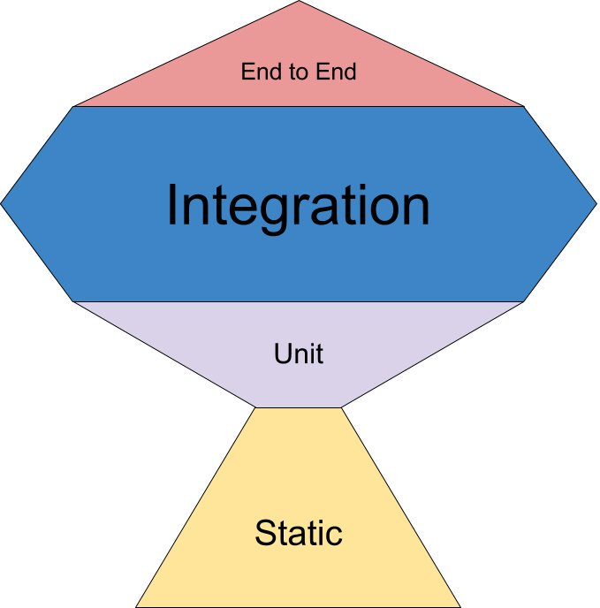

# Types of Test

- Unit tests: check units in isolation, what is considered to be a _unit_ can change from the context

- Component tests: test of Components of modern JavaScript frameworks

- Integration tests: check that multiple units behave as expected when used together

- UI Integration tests: check the whole application works without a real back-end

- E2E tests: check the whole app, back-end and database included, works as expected

- Visual Regression tests: check that the app look doesn't change when not intended

You can read more in the [Component vs (UI) Integration vs E2E tests]UI tests classification](https://dev.to/noriste/component-vs-ui-integration-vs-e2e-tests-3i0d) article.

!INCLUDE "test-types-comparison.md"

### Testing Pyramid

The "Test Pyramid" is a famous metaphor in the programming world about the cost-effort of diffent types of testing and how much of each should be present in a codebase (where the top very expensive and the bottom less expensive)

    

  

While the Testing Pyramid idea has been based on solid arguments, it considered UI and (most) integration tests non cost-effective due to high cost of development and maintainance but this idea predates most of recent discoveries and tools in testing that are now available.

Kent C. Dodds created a new version of the pyramid, the "the Testing Trophy". Kent created the trophy based not only on the cost of the tests but on the **return of investment**. He highlighted the "Integration test" area as the most important one ([Write tests. Not too many. Mostly integration.](https://kentcdodds.com/blog/write-tests/) by Kent C. Dodds)

    

  

Author: <a href="about-us.md#stefano-magni">Stefano Magni</a>

